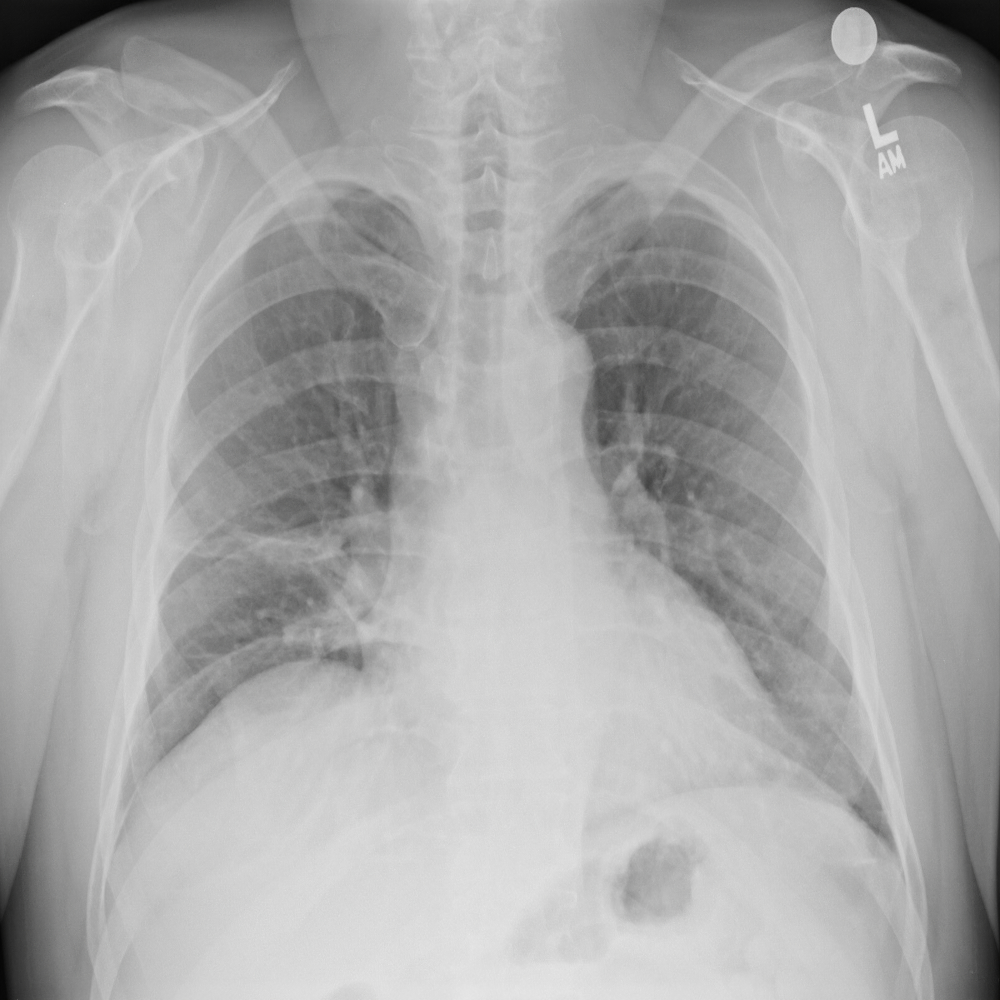

# Chest_X-ray

Transfer Learning enables a variety of computer vision projects without the need to train a Convolutional Neural Net (CNN) from scratch (important because the computing resources required to do so are often available to large institutions only). Today, most Transfer Learning projects rely on a few specific datasets (e.g., ImageNet) which have proven to be useful, but which are limited to specific domains. The goal of this Notebook is to explore the feasibility of creating pre-trained models which are domain specific, and to know whether this will significantly improve the accuracy. For example, the U.S.-based National Institute of Health (NIH) has released a dataset of labeled chest x-rays, and it should be possible to improve classification accuracy on this dataset and/or similar datasets by first creating a "baseline" set of pre-trained weights which could be applied to classification, detection, localization efforts which involve x-ray images. This is a Supervised Learning project.

* Dataset can be downloaded from below link:- https://www.kaggle.com/nih-chest-xrays/data

I Strongly recommended that use google colab to retrieve data and run code.

## Steps to Execute the Code:-
--------------------------------------------------------------------------------------------------------
1. Download the dataset and extract all images_.zip in one folder(i.e input_images).
2. Download code and put in same directory where input_images is available.
3. Put Data_Entry_2017.csv file in same directory.
3. Now Execute _.ipynb file line-by-line.

